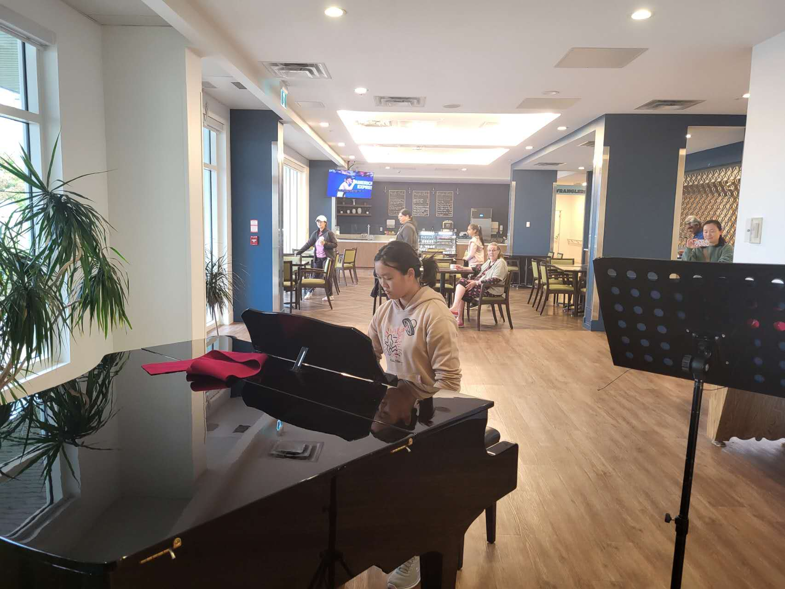

# HarmonYouth Foundation Website — Guide & Handoff Notes

The redesign, built for real. Everything about how the site works and how to update it yourself.

**Repo:** github.com/Wu-Adam1234/HarmonYouth-Foundation
**Contact on site:** harmonyouthfoundation@gmail.com · (403) 926-6122 · Instagram @harmonyouthfoundation
**Slogan:** "We play music. We build devices. We show up for people." — in the footer of every page.

**Where the files are on this Mac**
- Working folder: `~/Documents/harmonyouth-website/` — edit here
- Zipped copy: `~/Documents/harmonyouth-website.zip` — 34MB, 126 files, for backup or sharing

The zip is a snapshot, not the working copy. If you edit the folder, re-zip it (right-click the
folder → Compress) or the zip goes stale. **You cannot upload the zip to GitHub and have it
unpack** — GitHub stores it as a single file. To publish, upload the *contents* of the folder.
The zip is for keeping a backup and for emailing the whole site to someone.

---

## 0. What this is

This is **path 2 from section 13 of the old guide: the full rebuild.** The Claude Design mockups (`.dc.html` files) were prototypes that only ran inside that tool's runtime. This is the same design rebuilt as plain HTML, CSS and JavaScript that runs anywhere — no frameworks, no build step, no npm. You can edit any file in a text editor, re-upload it, and it works.

**It also fills the five gaps the mockups left open**, using the content from the old live site:

| Gap in the mockups | How it's covered now |
|---|---|
| No Team page | `team.html` — Adam, Hanry and Arthur's full bios, plus Vienna Lu on marketing and outreach |
| No Build meets page | `build-meets.html` — schedule with List/Calendar toggle, what to expect |
| Forms were `mailto:` links | Three real Formspree forms on `get-involved.html`, with the parent-email confirmation check and the full-panel confirmation screens |
| No calendar views | Both `performances.html` and `build-meets.html` have the List/Calendar toggle back |
| No WeChat / offline donation route | WeChat and GoFundMe QR codes on both `donate.html` and `get-involved.html` |

---

## 1. The pages

| Page | File | What's on it |
|------|------|--------------|
| Home | `index.html` | Scroll-driven hero, stat strip, "How a show runs" 01/02/03, Programs accordion, piano spotlight illustration, next/last shows, three photo carousels, FAQ accordion, donate block |
| Mission | `mission.html` | Why the org exists, three principles, the three founders in brief, "what we measure" stats |
| Programs | `programs.html` | Program 01 (music) and Program 02 (Build) in full, the 00:00→00:35 set timeline, practical-questions accordion |
| Performances | `performances.html` | The next two shows as detail cards, full schedule with List/Calendar toggle, every show played, the four venues, booking panel |
| Photos | `photos.html` | Eleven card carousels — every past performance — with a full-screen lightbox |
| Build meets | `build-meets.html` | Upcoming meets (list + calendar), how a build meeting runs |
| Meet the team | `team.html` | Adam's, Hanry's and Arthur's bios, then Vienna Lu (Marketing and Outreach Lead) |
| Get involved | `get-involved.html` | Three jump cards, the three Formspree forms, volunteer hours + service letter panels, FAQ, QR codes |
| Donate | `donate.html` | Where the money goes, the 100% callout, GoFundMe widget, QR codes, other ways to help |
| Privacy policy | `privacy.html` | Ten numbered sections |
| 404 | `404.html` | Piano-themed not-found page with a working search and a playable octave |

Shared by all of them: `styles.css`, `site.js`, `harmonyouth-logo.png`, and the photos.

**Every page has the same header** (logo, light/dark switch, Menu button) and the same footer. The Menu dropdown is the only navigation — there is no nav bar.

---

## 2. How to update the live site

1. Go to the repo on GitHub
2. Click **Add file → Upload files**
3. Drag in the changed files (or all of them — overwriting is fine)
4. Scroll down, click **Commit changes**
5. Wait ~1 minute, then **hard-refresh** the live page (Cmd+Shift+R / Ctrl+Shift+R)

**On the first upload of this rebuild**, also delete the old site's leftover files from the repo,
or they will sit there unreachable: `script.js`, the old `styles.css` is overwritten but
`making.html` (if still present) and the `assets/` folder holding `piano-film.mp4` /
`piano-film.webm` are no longer used by any page. The redesign has no scroll-scrubbed film
section — the hero replaced it.

> **If a change doesn't appear, it's almost always the browser cache, not a broken upload.**
> `styles.css` and `site.js` are linked as `styles.css?v=2` and `site.js?v=2` in every page. If you change either file and people still see the old version, bump that number to `?v=3` everywhere (find-and-replace across the `.html` files). That forces every browser to re-download it.

---

## 3. Common edits

### Add or change a performance

Two places, and they must agree.

**1. The list row** in `performances.html`, inside `<div class="panel" data-view="list">`:

```html
<div class="show-row">
  <div class="show-date">Sep 12</div>
  <div class="show-venue">
    <span class="name"><a href="MAPS_LINK" target="_blank" rel="noopener" class="venue-link">Venue Name</a></span>
    <span class="sub">2:00 to 2:30 PM</span>
  </div>
  <div class="show-status">Recruiting</div>
</div>
```

Keep rows in date order. Status options — this is the class on the last div plus its text:
- `<div class="show-status">Recruiting</div>` — default
- `<div class="show-status full">Full</div>` — greyed out
- `<div class="show-status talks">In talks</div>` — lighter gold
- `<div class="show-status past">Played</div>`

**2. The calendar entry** in `site.js`. Search for `SCHEDULE DATA` near the top:

```javascript
'2026-09-12': [['SG', 'recruiting', '2:00 to 2:30 PM']],
```

Format is `'YYYY-MM-DD': [['VENUE_CODE', 'status', 'time']]`. Two shows on one day go in the same array. Venue codes come from the `venues` object just above — add a new venue there first or the chip renders blank. Valid statuses: `recruiting`, `full`, `talks`, `past`, `cancelled`.

**Months are 0-indexed**, so `m: 7` is August and `m: 9` is October. `min` and `max` are how far back and forward people can page; `start` is the month it opens on. **If you add a show past `max`, bump `max` or nobody can page to it.**

### Move a show from upcoming to past

1. Move its row down into the "Every show so far" panel in `performances.html`, and change the status cell to a Photos link
2. Change its calendar status in `site.js` to `'past'`
3. Add a gallery on `photos.html` (below)

### Add a photo gallery

1. **Resize the photos first** — phone photos are 5–10MB each and will make the page painfully slow. Aim for ~1600px wide, JPG, quality ~80.
2. Name them consistently: `venue-date-1.jpg`, `venue-date-2.jpg` (e.g. `scenicgrande-sep6-1.jpg`)
3. Upload them to the repo
4. In `photos.html`, copy an existing `<div class="carousel-block">` and swap the filenames

Each card looks like this:

```html
<button type="button" class="car-card" data-card
        data-cat="Venue · Sep 6" data-title="Short caption"
        data-body="The longer caption shown in the lightbox.">
  
</button>
```

**Use `data-src`, not `src`.** That's what makes photos load lazily — `site.js` only downloads them when the carousel scrolls near the viewport, which is what keeps the page fast with ten galleries on it. `data-title` and `data-body` are what the lightbox shows when someone taps the card.

**Cards themselves carry no visible caption or dark veil anymore** — as of the September 2026 pass, every card is just the clean photo (see "Build decisions worth knowing," section 8). Still fill in `data-cat`, `data-title` and `data-body` on every card — they're what the full-screen lightbox shows when someone taps it, they just don't render on the card face itself.

Give the carousel block an `id` (e.g. `id="the-scenic-grande-sep-6"`) so `performances.html` can link straight to it.

Newest gallery goes at the top.

### Add or change a build meet

Same two places, in `build-meets.html` (the list row) and `site.js` → `BUILD_MEET_CALENDAR`. The default status text there is **Spots open** rather than Recruiting — that wording comes from the `labels` object on that calendar.

**Both Prev and Next are greyed out right now** because `min` and `max` are both September 2026 — one meet, one month. That's intentional, not broken. Add an October meet and bump `max` to `{ y: 2026, m: 9 }`.

**Two spots still say "Location to be confirmed"**: the `.sub` line in the list row, and the `BM` entry in `BUILD_MEET_CALENDAR.venues`. Both need updating when you have an address.

### Change the volunteer hour wording

The claim appears in **seven** places and they have to stay consistent. Two things must match everywhere: **four hours** is a total across both programs, not four hours of performing, and **service letters are available on request**.

| Where | File |
|-------|------|
| Menu dropdown (on all 11 pages) | the `menu-note` block in every `.html` file |
| Homepage stat strip | `index.html` → "Hours per certificate" |
| Homepage FAQ answer 03 | `index.html` |
| Performer form badge | `get-involved.html` → `.perk` in `#perform` |
| Maker form badge | `get-involved.html` → `.perk` in `#build` |
| Volunteer hours panel | `get-involved.html` |
| Under the schedule | `performances.html` and `build-meets.html` |

If you change the number or the rule, change all of them.

### Change a team bio or photo

Bios live in `team.html`, one `<section class="founder">` each.

**Crop before you upload.** The photo box is portrait, roughly **0.63 wide-to-tall** (e.g. 880 × 1384). `object-fit: cover` fills the box and trims the rest, so a landscape photo gets chopped hard on both sides. Around 880px wide at JPEG quality 85 keeps files near 200KB — `hanry-cofounder.jpg` is currently 2MB, which is far larger than it needs to be.

If the face sits off-centre, nudge it with `style="object-position:center 20%;"` on the `` rather than re-cropping. Adam's uses `center 62%`, Hanry's `62% 8%`, Arthur's `center 30%`.

**Photos of members under 18 need a signed release** before they go up, same as resident photos.

### Add a page to the menu

The menu block is **repeated in all 11 files** — that's the cost of having no build step. Add your `<a class="navlink">` row to each one, and add the page to `ROUTES` at the top of `site.js` so the search can find it.

---

## 4. How the forms work

All three forms on Get Involved submit to **Formspree** (free tier) → harmonyouthfoundation@gmail.com.

- Form ID: `xnjkdgge` — set once, as `FORM_ID` near the bottom of `site.js`
- Each form has its own hidden `_subject` field, so the email subject tells you which panel it came from
- Submissions also appear in the Formspree dashboard (formspree.io, log in with the org Gmail)
- Free tier has a monthly submission limit

**Performer form (`#volunteerForm`)** collects name, instrument, area, performer email, parent/guardian email + confirmation, dates, phone.
**Maker form (`#makerForm`)** collects name, email, phone, parent/guardian email + confirmation, and free-text details.
**Everything-else form (`#helpForm`)** collects name, email, optional parent/guardian email + confirmation, message. The parent fields here are **optional on purpose** — care home staff, media and partners use this form too, and making it required would stop them submitting.

**The parent-email confirmation check is generic.** Any input with `data-confirm-for="<id of the first email field>"` is checked automatically, and the error appears in the `.fs-error` span next to it. Leaving both blank passes, which is what makes the optional version work. A fourth form needs nothing but that one attribute.

**The confirmation screen** replaces the whole form in place — no page reload. The wording lives in `SUCCESS_CONTENT` in `site.js`, keyed by form ID. `SHOWS_LINK` and `IG_LINK` are defined once just above it and reused in all three messages, so changing the Instagram handle is a one-line edit. If you add a form and skip its `SUCCESS_CONTENT` entry, it falls back to a plain "Sent!".

If a submission fails, the form stays put and shows a line telling the person to email instead — nothing is silently lost.

---

## 5. Design notes

All colours are defined once at the top of `styles.css`, in two blocks: `:root` (dark) and `[data-hy-theme="light"]`.

```css
--bg:#07080A;        /* page background */
--accent:#C9A15A;    /* gold — buttons, links, highlights */
--accent-soft:#E8C87A;
--text:#F4F6F8;
--muted:rgba(244,246,248,.60);
--faint:rgba(244,246,248,.52);
```

**If you change these, check the contrast.** The light-mode gold is `#8A6520` rather than the
brighter `#A97C2B` from the mockups, because the brighter one only reached 3.4:1 against the
page and 3.8:1 behind white button text — both below the 4.5:1 WCAG AA minimum. Every
text/background pairing in both themes currently clears 4.5:1. A lighter gold will fail again.

The hero is a special case: its photo carries a dark scrim in *both* themes, so the hero's own
text and the header sitting over it are pinned to light (`#FBFAF7`) regardless of colour mode.
That's the `.hero :focus-visible` / `.site-header.over-hero` block in `styles.css`, plus the
`over-hero` class that `site.js` toggles on scroll. Without it, light mode put near-black text
on the dark photo at 2.5:1.

The look is **liquid glass**: every button, arrow and toggle is a transparent pill with an inset light-ring shadow stack (`--glass`) plus an SVG displacement filter (`#hy-glass`, defined at the top of each page's body). Fonts are **Inter** for headlines and UI, **Open Sans** for body text.

**Light/dark** is toggled from the header and saved in the browser under `hy-theme`. It applies to every page.

**Interactive pieces, in case you wonder what's moving:**
- **Hero** — pinned to the top of a 260vh section; scrolling through it expands the photo from a card to full-bleed while the headline splits apart. This is real scrolling; nothing is hijacked, and it degrades to a static hero with "reduce motion" on.
- **Menu dropdown** — Escape or a click outside closes it; the two bars morph into an X
- **Search** — in the dropdown on every page and in the middle of the 404. The placeholder rotates every 3.4s. Typing a word matches it against `ROUTES` and navigates.
- **Fluid cursor** — a soft warm trail; off automatically on touch devices and with reduce-motion
- **Carousels** — snapping horizontal rows; photos blur up as they load; arrows disable at each end
- **Lightbox** — click any card for the photo, category, headline and caption
- **Piano spotlight** — the "Built to keep coming back" CTA band on the homepage. A black-and-white outline of a grand piano (`piano-outline.jpg`) sits under a full-colour version (`piano-color.jpg`); the colour layer is CSS-masked to a circle that follows the cursor, so hovering "lights up" the piano in colour wherever you point. Wired in `initPianoSpotlight()` in `site.js`. Replaces the old "MUSIC FOR EVERYONE" outlined-text headline.
- **Accordions** — one row open at a time
- **Scroll progress bar** — two-pixel gold bar at the very top
- **Dot rail** — right edge of the homepage, highlights the section you're in
- **404 piano** — seven keys, one missing. Click them or press A S D F G H J.

Everything above is disabled or simplified when the visitor has **"reduce motion"** turned on.

---

## 6. Things to keep on top of

- **Check the Formspree inbox.** The confirmation screen promises people they're on the roster. If nobody's watching that inbox, that promise breaks.
- **Get photo consent before posting anyone.** For residents, a staff member or family member typically needs to sign. Care facilities are strict about resident privacy for good reason.
- **Update statuses after each show.** A page full of "Recruiting" for dates that already passed looks abandoned.
- **Compress photos before uploading.** The site is ~31MB, almost all photos. Galleries load lazily so the cost lands on people who scroll to them, but it still adds up.
- **Fill in the build meet location.** Two spots still say "Location to be confirmed."

---

## 7. Things to confirm before this goes public

These came across from the mockups and are stated as fact on the site:

- [ ] **The donation claim.** "100% to the hospitals and senior homes we support, HarmonYouth takes none" appears on the homepage, `donate.html`, and twice on `mission.html`. No hospital is named by name anywhere on the site — that was deliberate; keep it that way unless you have permission to name one. **If the arrangement is ever anything other than 100%, all four places have to change together.**
- [ ] **The privacy policy** is a plain-language draft, not lawyer-reviewed. Have an adult read it — especially the retention period ("one year after your last performance") and the under-18 process.
- [ ] **September and October dates.** Sep 6, Sep 13, Sep 25, Oct 4 and Oct 11 are hardcoded in two places each. They go stale on their own.
- [ ] **Verify the Google Maps links.** Two of them are map *searches* rather than pinned locations — click each once to confirm it lands on the right building.
- [ ] **The Build program has no photo yet.** `programs.html` has a labelled placeholder where one goes after the first build meet.
- [ ] **Vienna Lu's photo and bio are blank.** `team.html` shows a "Photo to come" placeholder and "Bio to come." Swap in a portrait cropped to roughly 0.63 wide-to-tall (see "Change a team bio or photo" above), replace the `<p class="bio-pending">`, and drop the `empty` class off the `.founder-photo` div.

---

## 8. Build decisions worth knowing

Things that were changed deliberately during the rebuild. If something looks "wrong" compared to
the mockups, check here first — it was probably on purpose.

**The hero does not lock your scroll.** The mockup pinned the page with `body{overflow:hidden}`
while the hero photo expanded. That doesn't actually stop the page scrolling (the scroll container
is the `<html>` element, not `<body>`), and it trapped keyboard and screen-reader users with no way
out. The hero is now a 260vh section with the photo `position:sticky` inside it — it expands as you
scroll through, looks the same, and it is ordinary scrolling the whole way. It collapses to a
static hero when "reduce motion" is on.

**The logo is 256px, not 1254px.** The original was a 740KB PNG rendering at 36×28 pixels, loaded
on all 11 pages — about a quarter of the photos page's initial weight for a thumbnail. It is now
48KB. If you ever replace it, export it around 256px; do not drop a full-resolution export in.

**Contrast was corrected against the mockup palette.** See section 5. Short version: the light-mode
gold is darker than the mockups', the muted/faint greys are stronger in both themes, and the hero
foreground is pinned light. Every text pairing now clears the 4.5:1 WCAG AA minimum.

**Keyboard focus is explicit.** The glass pills are translucent, which swallowed the browser's
default focus ring — tabbing through the forms showed nothing at all. There is now a gold
`:focus-visible` outline. Don't remove it.

**Gallery photos load lazily.** Photos carry `data-src`, not `src`; `site.js` swaps them in when
the gallery nears the viewport. On the Photos page that means 5 images load on arrival instead of
104. Keep using `data-src` when you add galleries.

**September 2026 pass — piano spotlight, caption removal, thinner cursor trail.** Three changes
made after the initial rebuild:
- The homepage CTA band's "MUSIC FOR EVERYONE" outlined-text headline was replaced with the piano
  spotlight illustration described in section 5. The old SVG text/mask markup, its `.hovertext`/
  `.ht-base` CSS and the `hyDash` keyframe are gone; `initHoverText()` in `site.js` was replaced by
  `initPianoSpotlight()`.
- Every gallery card's on-card caption (`.cap`) and the dark bottom veil (`.veil`) that existed to
  keep that caption legible were removed, on both `index.html`'s and `photos.html`'s carousels —
  cards now show only the clean photo. The full-screen lightbox is untouched and still reads
  `data-cat` / `data-title` / `data-body` from the card, so keep filling those in when you add a
  gallery (section 3).
- The fluid cursor trail (`initCursor()` in `site.js`) was retuned smaller and softer — it had
  drifted thick and blobby. If a future edit makes it feel heavy again, the knobs are the particle
  radius (`r: 16 + Math.min(20, d * 0.55)`), the per-frame opacity (`0.13`), and the fade-out rate
  of the trail (`rgba(0,0,0,0.13)` in the clear step) — smaller radius and lower opacity read as
  thinner and lighter.

**Source archives.** This site was built from three archives — the old live site, the Claude Design
mockup handoff, and a Google Drive export of the August 30 photos. Everything from all three that
the site uses is already in this folder, so they were cleared out afterwards. Two things existed
only in those archives and are *not* here: the old homepage's `piano-film.mp4` / `.webm` (the
redesign has no film section), and the original full-resolution August 30 photos (this folder has
them resized to 1600px, which is what the site should serve anyway). If you ever need either, they
are in the Trash or can be re-exported from Google Drive.

---

## 9. Design audit notes (September 2026) — not yet applied

A design review was run against the site's anti-generic-design principles. Nothing below has been
changed in the code — these are recommendations for whoever picks this up next.

**What's working:** the hero (a real performance photo expanding on scroll, not a generic
gradient-blur headline), the piano spotlight (section 5 — genuinely grounded in the subject), and
the liquid-glass buttons (a bespoke, consistently-executed micro-interaction).

**What reads as templated:**
- [ ] **The "Get involved" FAQ accordion** (five questions, numbered `01`–`05`) is a stock SaaS-FAQ
  pattern — numbered dividers, plus/× toggle, thin question text — and the numbering doesn't mean
  anything: the five questions aren't a sequence. Compare to the "How a show runs" `01/02/03` cards
  earlier on the same page, where the numbering *is* real (Booking → Lineup → After). Likely fix:
  drop the numbers from the FAQ, keep them on the process cards.
- [ ] **Typography has no distinct personality.** Inter (headlines + UI) + Open Sans (body) is one
  of the most common pairings in web design generally — safe, but not specific to HarmonYouth.
- [ ] **Dark mode's structure** — near-black background (`#07080A`) plus exactly one accent colour
  (`--accent:#C9A15A`) — matches a well-known generic-AI-design formula (near-black + single bright
  accent), independent of the specific gold hue chosen. See the palette proposal below for a
  low-risk fix.
- [ ] **Motion is scattered rather than one signature moment.** Counted running at once: hero
  scroll-lock, sitewide fluid cursor trail, piano spotlight, carousel blur-up, accordion expand,
  scroll progress bar, dot rail. Worth considering whether the ambient chrome (progress bar, dot
  rail, cursor trail) should recede so the hero's scroll expansion reads as *the* signature moment
  rather than one effect among several.

**Proposed palette fix — "Concert Red" as a second accent.** Rather than repainting the palette,
pull a second colour from imagery already on the site: the red velvet seats and chandelier in the
piano illustration (section 5). Adding it as a genuine second accent breaks the
single-accent-on-near-black formula without touching the gold, the logo, or any already-validated
contrast pairing.

```
#8C2F38  (base)
├─ 300 #CB7881 → text on dark bg:            6.24:1  (AA)
├─ 500 #8C2F38 → filled badge, light text:   7.52:1 dark theme / 8.14:1 light theme  (AA/AAA)
└─ 600 #6E232B → text on light bg:           9.76:1  (AAA)
```

Suggested use — small and deliberate, not a repaint: give the `talks` show-status pill (currently
reuses the gold `--accent-soft`) its own red, so "In talks" reads differently from "Recruiting" at
a glance. Keep it out of primary buttons/CTAs — gold stays the dominant brand colour, red is the
accent-to-the-accent, per the 60-30-10 rule.

**Current palette accessibility (validated independently, September 2026):** every text/background
and text/button pairing in both themes clears WCAG AA (4.5:1). Only the two primary text colours
against their backgrounds clear AAA (7:1) — the muted/faint text tokens and the gold accent land in
the 4.5–6.9:1 range in both themes, same conclusion as section 5's contrast note, now re-verified
with `check_contrast.py`.

---

## 10. Quick reference

| Thing | Where it lives |
|-------|----------------|
| Upcoming shows list | `performances.html` → `data-view="list"` |
| Performance calendar data | `site.js` → `PERFORMANCE_CALENDAR` |
| Build meet calendar data | `site.js` → `BUILD_MEET_CALENDAR` |
| Calendar rendering | `site.js` → `initCalendar()` |
| Photo galleries | `photos.html` → `.carousel-block` |
| Piano spotlight (homepage CTA band) | `index.html` → `.piano-hover`; `site.js` → `initPianoSpotlight()`; images `piano-outline.jpg` / `piano-color.jpg` |
| Fluid cursor trail | `site.js` → `initCursor()` |
| Homepage hero behaviour | `site.js` → `initHeroLock()`; `styles.css` → `.hero-scene` / `.hero` |
| Forms | `get-involved.html`; wiring in `site.js` → `initForms()` |
| Formspree form ID | `site.js` → `FORM_ID` |
| Confirmation screen wording | `site.js` → `SUCCESS_CONTENT` |
| Search keywords and destinations | `site.js` → `ROUTES` |
| Rotating search placeholders | `site.js` → `PLACEHOLDERS` |
| Menu rows | the `menu-links` block — repeated in all 11 `.html` files |
| Team bios | `team.html` |
| Vienna Lu's role card | `team.html` → `.recruit` |
| Contact info | footer of every page |
| All colours, fonts, glass recipe | `styles.css` → `:root` and `[data-hy-theme="light"]` |
| All interactivity | `site.js` |
